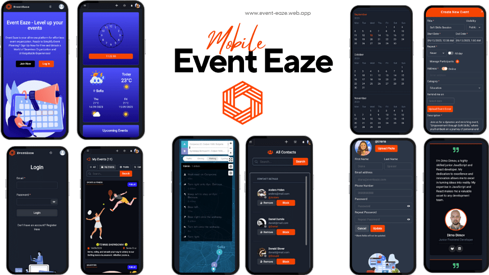
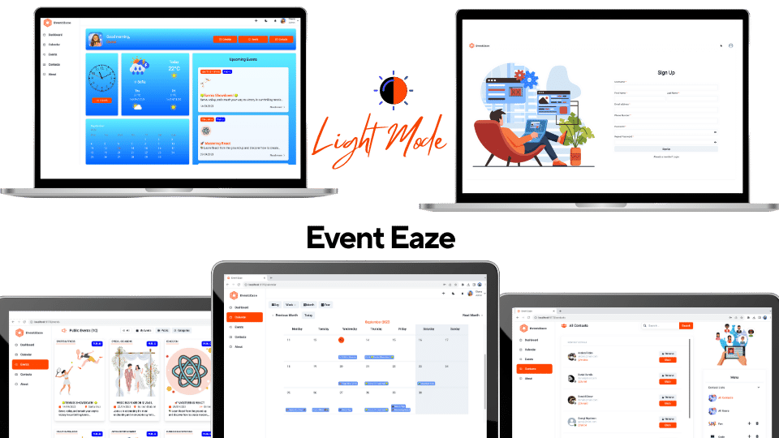
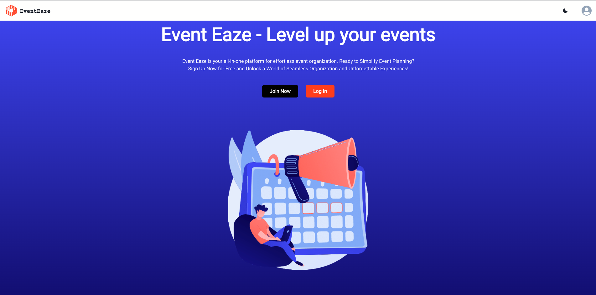
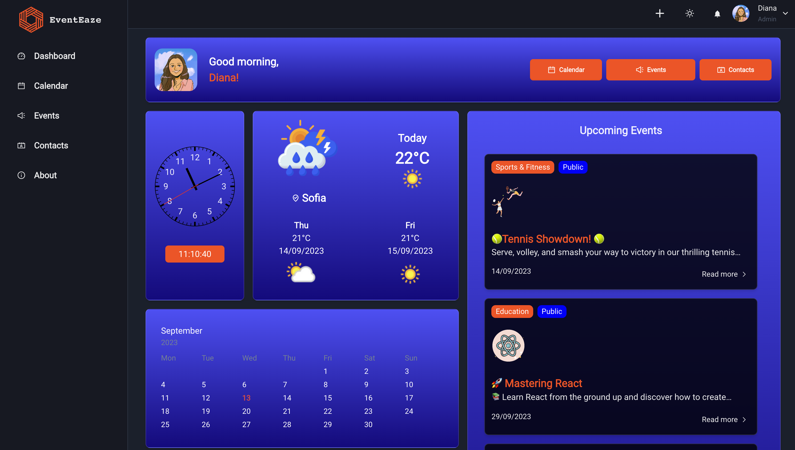
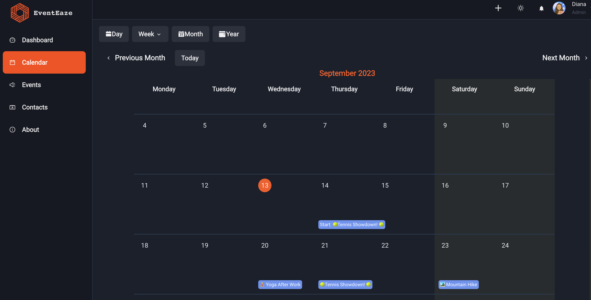
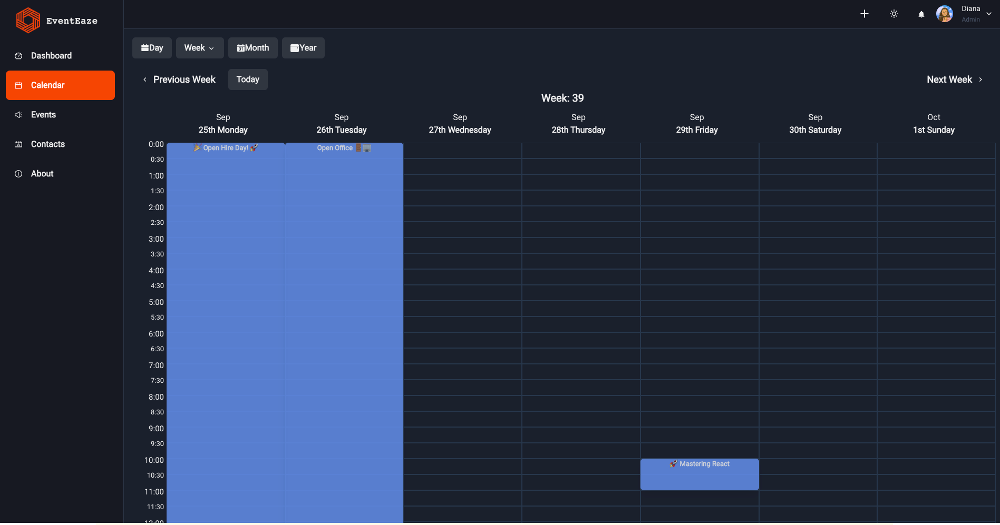
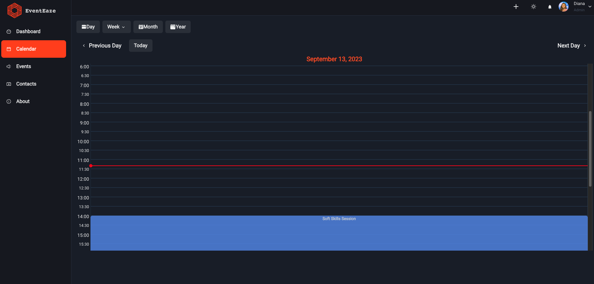
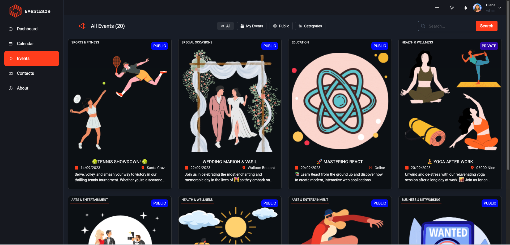
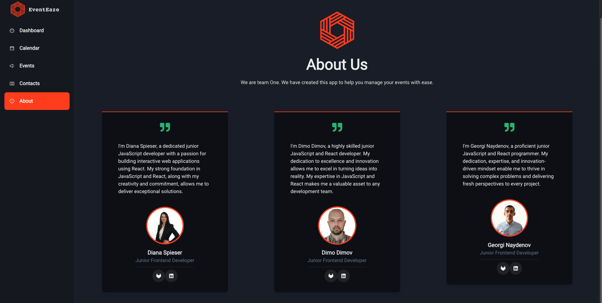

# EventEaze Documentation


Welcome to the comprehensive documentation for the "EventEaze" project. This guide presents an in-depth exploration of the project's purpose, functional specifications, technical intricacies, and the potential inclusion of optional features.





















## Project Overview
 [EventEaze](https://event-eaze.web.app/) is a powerful and user-friendly event calendar application that simplifies event planning and participation. Whether you're hosting an event or looking for exciting gatherings to attend, EventEaze Calendar has you covered.


## Functional Components

### Entity Management (Documents)

### User

 - Each user profile necessitates a first and last name, email, username and phone number.

- First and last names are confined within a character range of 3 to 30.

- Email entries must be both valid and unique within the system.

- Phone number must have 10 digits and be unique.

 ### Admin

 - Admin profiles mirror user attributes, comprising of first and last names, and a unique email and phone number.


- Name constraints of 3 to 30 characters apply.

- Unique email and phone number requirement remains.

### Event

- Every Event has an id, title, a start date and hour, an end date and hour, location, and a list of invited participants

- Titles are constrained to a length ranging from 30 to 30 characters.

- Content occupies a length window of 3 to 500 characters.
- Publicity can be Public or Private
- Event can be part of series of reoccurring ( yearly, monthly, weekly, daily )
- Event has a map attached with it's exact location and user can get the directions to reach the event by walking, driving or using public transports

### Calendar
The calendar has different standard calendar views – day, week, month, work week.

### Contacts lists

 - Contact list have an id, an owner and a list of the contacts they contain.
- Contacts lists have a name (e.g., “Work Contacts”, “Personal Friends”, etc.).

## Public Interface

- The landing page showcases pivotal platform features.

- Registration and login functionality is accessible to anonymous visitors.
-  Anonymous users are privy to lists of the public events and have to register in order to see the full event details.
- The landing page has a search functionality used to search for public events.

## Private Features

- Authenticated users enjoy seamless login and logout capabilities.

- Browsing of events created by fellow users, complete with sorting and filtering options.

- Comprehensive event viewing, encompassing title, content, start date, end date, address and participants . This interface further facilitates actions like joining and direct editing.

-  Profile enhancements, including the ability to upload a personalized profile photo.

- Event creation is streamlined with minimum title and content prerequisites.

- User-exclusive event editing.

- Independent event removal capability.


## Administrative Control

- Administrative users wield the power to conduct user searches through usernames, emails, or display names.

- User management by admins extends to user blocking/unblocking, directly affecting event and login  permissions.

- Complete event deletion is within the scope of admin actions.

- Admins enjoy the capability to explore, filter, and sort all events.

## Optional Enhancements

- **Real-Time Notifications**: The app offers real-time notifications, ensuring that users are promptly informed about event invitations and updates. Stay connected and never miss an important event update or invitation.
- **Weather Integration**: The app includes a weather integration feature that allows users to check the current weather and forecasts for event locations. Stay informed about weather conditions and plan your event attendance accordingly.

- **Interactive Event Maps**: With the integrated Mapbox API, users can access interactive event maps within the app. Explore event venues, get directions, and discover nearby amenities with ease.

- **Inspirational Quotations**: Enjoy a touch of inspiration on the app's dashboard with daily motivational quotes. These uplifting quotations provide users with a positive and empowering experience.


## Technical Specifications
 ### Coding Guidelines

 - Coding adheres to **Object-Oriented Programming (OOP)** principles whenever applicable.

 - The spirit of **KISS** (Keep It Simple and Straightforward), **SOLID**, and **DRY** (Don't Repeat Yourself) principles guides the codebase.

 - **Functional programming** principles, including pure functions and judicious use of array methods, are seamlessly integrated.

 - A structured project architecture, featuring distinct layers, ensures **clarity and scalability**.

 - **Exception handling** is meticulously implemented, maintaining a graceful error propagation mechanism.

 - **Git** serves as the chosen version control system, preserving a detailed commit history capturing project evolution and the contributions of all team members.

### Firebase Realtime Database


- The entirety of the project's data resides within the versatile NoSQL database offered by Google Firebase.

-  The document structure within the database aligns harmoniously with the comprehensive functionalities described earlier.

### Optional Additions

-  Integration with a Continuous Integration (CI) server, such as GitLab's CI, affords the benefits of automated unit testing upon every commit to the master branch.

- Git workflow emphasizes the use of branches for seamless collaboration.

- An ambitious goal of hosting the complete application on Firebase, incorporating both the Firebase Realtime Database and Firebase Hosting, sets the stage for a unified user experience.

## Hosting and Setup

To install and run the project locally, follow these steps:
Prerequisites

> Make sure you have Node.js and npm installed on your machine.

## Installation


Clone this repository to your local machine:

```bash
https://gitlab.com/dimodimov/event-eaze
```

Navigate to the project directory:

```bash
cd eventeaze
```
Install the required dependencies:
```bash
npm install --save --legacy-peer-deps
```
Start the development server:

```bash
npm run dev
```


## Database scheme
```
├── contactLists
│   ├── [contactListId]
│       ├── contacts
│       │   ├── [contactName]: true
│       ├── icon: [iconURL]
│       ├── key: [contactListId]
│       ├── owner: [ownerName]
│       ├── title: [title]

├── eventCategories
│   ├── [categoryName]: true

├── events
│   ├── [eventId]
│       ├── address: [eventAddress]
│       ├── authorId: [authorId]
│       ├── categoryId: [categoryId]
│       ├── description: [eventDescription]
│       ├── endDate: [eventEndDate]
│       ├── id: [eventId]
│       ├── isAllDay: [isAllDay]
│       ├── isOnline: [isOnline]
│       ├── isPublic: [isPublic]
│       ├── latitude: [eventLatitude]
│       ├── longitude: [eventLongitude]
│       ├── participants
│       │   ├── [participantName]: true
│       ├── photoUrl: [eventPhotoURL]
│       ├── reoccurring: [eventReoccurring]
│       ├── startDate: [eventStartDate]
│       ├── title: [eventTitle]
│       ├── userName: [eventUserName]

├── reminders
│   ├── [reminderId]
│       ├── description: [reminderDescription]
│       ├── eventId: [reminderEventId]
│       ├── recurring: [reminderRecurring]
│       ├── reminderId: [reminderId]
│       ├── reminderOn: [reminderOn]
│       ├── title: [reminderTitle]
│       ├── userName: [reminderUserName]

├── notifications
│   ├── [notificationId]
│       ├── notificationId: [notificationId]
│       ├── eventId: [eventId]
│       ├── ownerAvatar: [url]
│       ├── participant: [participantName]
│       ├── startDate: [startDate]
│       ├── title: [notificationTitle]
│       ├── userName: [eventOwnerUserName]

├── userStatus
│   ├── [userName]
│       ├── [loginSessionId]: true
|
├── users
│   ├── [userName]
│       ├── contactLists
│       │   ├── [contactId]: true
│       ├── contacts
│       │   ├── [contactId]: true
│       ├── createdOn: [createdOn]
│       ├── email: [email]
│       ├── events
│       │   ├── [eventId]: true
│       ├── firstName: [firstName]
│       ├── isBlocked: [bool]
│       ├── lastName: [lastName]
│       ├── phoneNumber: [phoneNumber]
│       ├── photoUrl: [photoUrl]
│       ├── role: [role]
│       ├── uid: [uid]
│       ├── userName: [userName]
```
